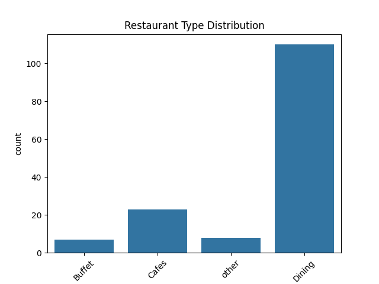
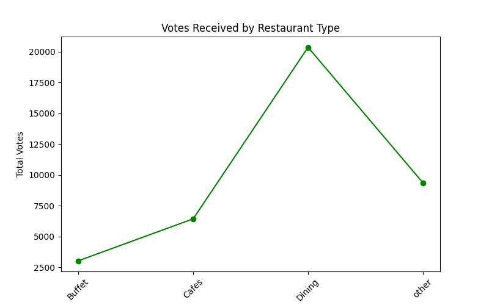
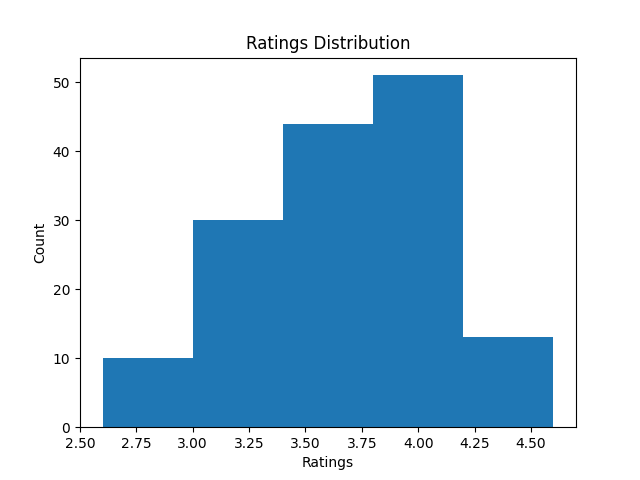
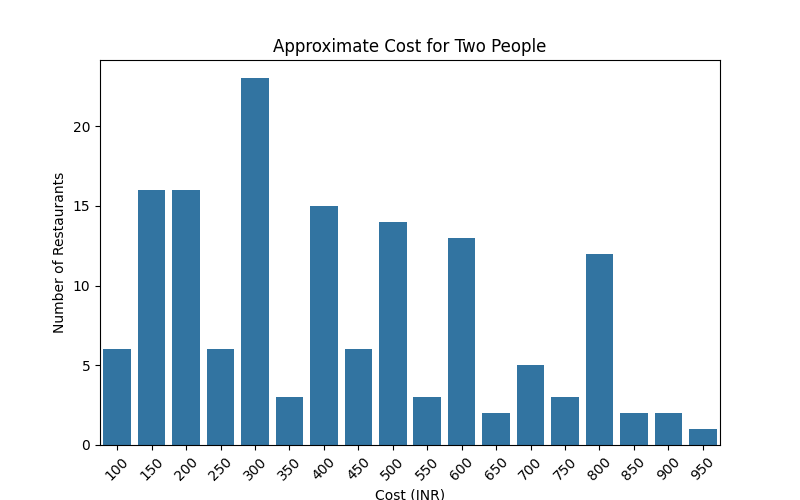
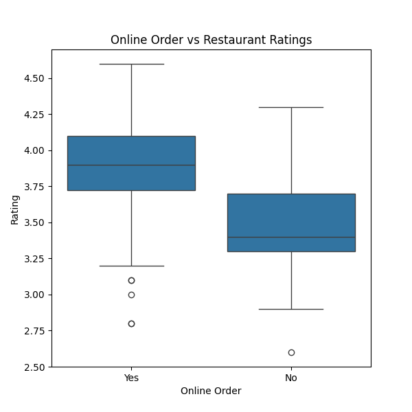
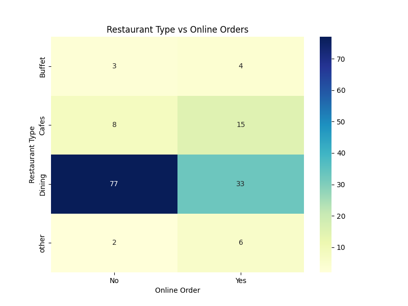

# Zomato Data Analysis Project

## Overview

This project analyzes restaurant data from Zomato using Python.

## Tools Used

* Python
* Pandas
* NumPy
* Matplotlib
* Seaborn

## Analysis Performed

### Question 1

What type of restaurant do the majority of customers order from?

### Question 2

How many votes has each type of restaurant received?

### Question 3

What ratings do most restaurants receive?

### Question 4

What is the average spending of couples?

### Question 5

Which mode (online or offline) receives higher ratings?

### Question 6

Which type of restaurant receives more offline orders?

## Author

Djoshi

## Visualizations

### Question 1

### Question 2

### Question 3

### Question 4

### Question 5

### Question 6

